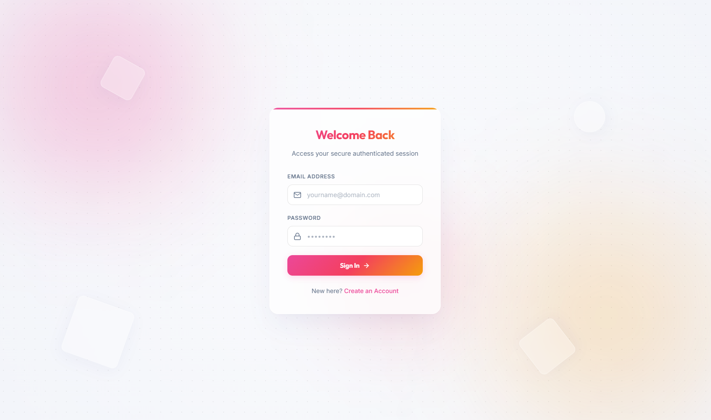
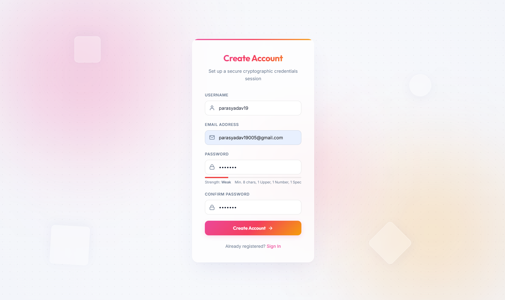
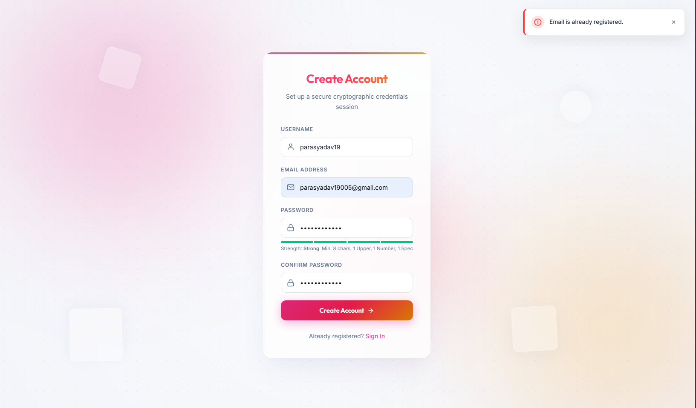
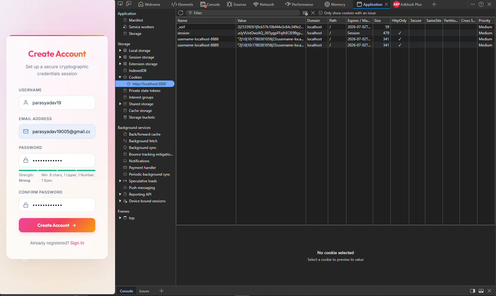
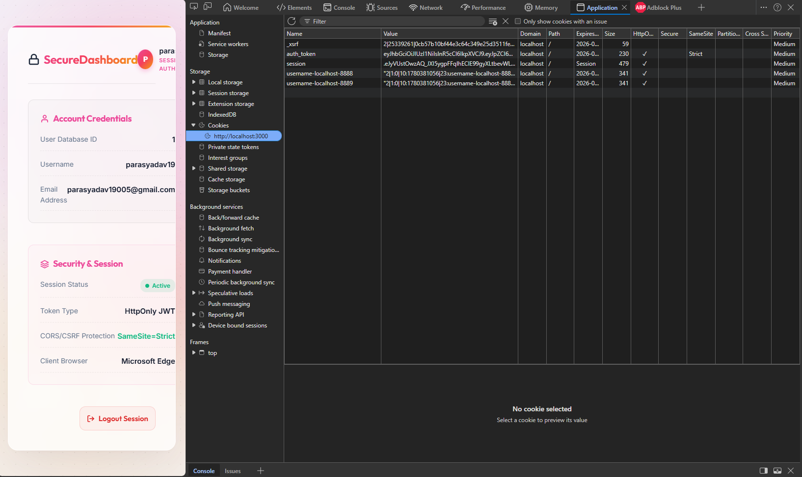
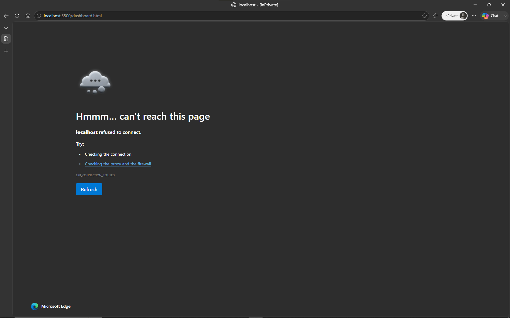

# Secure Authentication System

A production-ready user authentication system utilizing **Node.js (Express)**, a zero-dependency **Native SQLite** database, and secure **JWT cookie-based session management**. The frontend is built using **Vanilla CSS with a premium glassmorphic dark-theme design** and custom animations.

---

## 🚀 Key Features

1. **User Registration & Login**: Validates inputs (email patterns, username limits, password strength) and compares hashes securely.
2. **Password Hashing**: Uses `bcryptjs` (salt rounds = 10) for secure storage.
3. **Session Management (HttpOnly Cookies)**: Stores JWT tokens in `HttpOnly`, `SameSite=Strict` cookies, preventing Client-Side Scripting (XSS) and Cross-Site Request Forgery (CSRF) attacks.
4. **Endpoint Protection Middleware**: Restricts access to `/api/auth/me` and the client Dashboard.
5. **Interactive UI / Premium Aesthetics**: Glowing radial backgrounds, glass cards (`backdrop-filter`), client-side password strength meter, custom sliding toast alert system, and full page-loader transitions.

---

## 🛠️ Tech Stack

- **Backend**: Node.js, Express
- **Database**: Node.js Native SQLite (`node:sqlite` - zero external configuration, serverless)
- **Token Handling**: `jsonwebtoken`, `cookie-parser`
- **Password Crypto**: `bcryptjs`
- **Frontend**: HTML5, CSS3 (Variables, Custom Gradients, Animations), JavaScript ES Modules

---

## 📂 Project Structure

```
Authentication System/
├── package.json         # Node.js dependencies & scripts
├── server.js            # Entry point for Express server
├── .env                 # Environment variables
├── db.js                # Built-in SQLite connection & schema initialization
├── middleware/
│   └── auth.js          # Route protection JWT verification middleware
├── routes/
│   └── auth.js          # API route handlers (register, login, logout, me)
├── public/              # Client-side static resources
│   ├── css/
│   │   └── style.css    # Responsive premium CSS variables & styles
│   ├── js/
│   │   ├── auth.js      # Client authentication fetch logic & strength meter
│   │   ├── dashboard.js # Protected dashboard UI loader and logout action
│   │   └── toast.js     # Custom sliding notifications toast engine
│   ├── index.html       # Router root (performs initial session checks)
│   ├── login.html       # Login screen
│   ├── register.html    # Registration screen
│   └── dashboard.html   # Authenticated Dashboard screen
├── test_auth.js         # Integration tests suite
└── README.md            # Setup and documentation (This file)
```

---

## ⚙️ Installation & Setup

### Prerequisites

- Node.js installed (Version **v22.5.0 or later** is required for the native SQLite module).

### Installation Steps

1. **Install Node modules**:

   ```bash
   npm install
   ```

2. **Configure Environment Variables**:
   Open or modify the `.env` file in the root directory:
   ```env
   PORT=3000
   JWT_SECRET=f7e3c1b6ad7f4b88939c3e62f0a1e0cdb28e67a0a030f878f0d8a57e3f899acb
   NODE_ENV=development
   ```

---

## 🏃 Running the Application

### Development Mode (Auto-Reloading)

Runs the server with Node's native hot-reload watcher (`--watch`):

```bash
npm run dev
```

### Production Start

Starts the server normally:

```bash
npm start
```

Once running, navigate to **`http://localhost:3000`** in your web browser.

---

## 🧪 Running Integration Tests

The project includes a self-contained test suite (`test_auth.js`) that boots up an isolated test server, executes 11 validation/authentication scenarios (including edge cases), and prints a summary.

Run the test suite with:

```bash
node test_auth.js
```

---

## 🛡️ Security Implementation Notes

1. **Password Hashing (bcryptjs)**: Passwords are salt-hashed on registration. Plaintext passwords are never logged, stored, or transmitted back in responses.
2. **XSS Protection (HttpOnly Cookie)**: The session JWT token is stored inside an `HttpOnly` cookie. This makes it impossible for client-side malicious scripts (`document.cookie`) to read or hijack the session token.
3. **CSRF Protection (SameSite=Strict)**: Cookies are configured with the `SameSite=Strict` attribute, preventing browsers from appending the session cookie during cross-site requests.
4. **SQL Injection Prevention**: Built-in SQLite prepared statements (`db.prepare(...)`) are utilized with value bindings (`?`) for all queries, eliminating SQL injection vulnerability.
5. **Username Enumeration Mitigation**: The login endpoint returns a generic `'Invalid email or password.'` error for both non-existent emails and wrong passwords.

---

## 📝 API Endpoints Documentation

### 1. Register User

- **Endpoint**: `POST /api/auth/register`
- **Public access**: Yes
- **Request Body**:
  ```json
  {
    "username": "example_user",
    "email": "user@example.com",
    "password": "SecurePassword123!"
  }
  ```
- **Password Constraints**: Min. 8 characters, at least 1 uppercase letter, 1 lowercase letter, 1 digit, and 1 special symbol.
- **Success Response** (`201 Created`):
  ```json
  {
    "message": "User registered successfully!"
  }
  ```

### 2. Login User

- **Endpoint**: `POST /api/auth/login`
- **Public access**: Yes
- **Request Body**:
  ```json
  {
    "email": "user@example.com",
    "password": "SecurePassword123!"
  }
  ```
- **Success Response** (`200 OK` + Sets `auth_token` Cookie):
  ```json
  {
    "message": "Login successful!",
    "user": {
      "id": 1,
      "username": "example_user",
      "email": "user@example.com"
    }
  }
  ```

### 3. Logout User

- **Endpoint**: `POST /api/auth/logout`
- **Public access**: Yes (clears cookie)
- **Success Response** (`200 OK` + Clears `auth_token` Cookie):
  ```json
  {
    "message": "Logout successful."
  }
  ```

### 4. Fetch Authenticated User (Session Verification)

- **Endpoint**: `GET /api/auth/me`
- **Protected Access**: Yes (Requires valid `auth_token` cookie)
- **Success Response** (`200 OK`):
  ```json
  {
    "user": {
      "id": 1,
      "username": "example_user",
      "email": "user@example.com"
    }
  }
  ```
- **Error Response** (`401 Unauthorized`):
  ```json
  {
    "error": "Access denied. Please log in."
  }
  ```
  "# Authentication-System"

---

## 📸 Screenshots Blueprint

Capture the following screenshots to fulfill the submission requirements:

1.  **`01_login_page.png`**: The Login page displaying the form card in Light Mode.
    

2.  **`02_registration_password_strength.png`**: The Registration form displaying real-time password strength indicators (red for weak, green for strong).
    

3.  **`03_registration_error.png`**: Registration page showing an error warning (e.g., duplicate username or email exists).
    

4.  **`04_jwt_cookie_devtools.png`**: DevTools -> Application -> Cookies showing the `auth_token` cookie with the `HttpOnly` and `SameSite=Strict` checkboxes active.
    

5.  **`05_dashboard_protected.png`**: The logged-in dashboard screen showing the welcome message, user details, and active logout button.
    

6.  **`06_access_denied.png`**: Access denied response toast when attempting to visit `dashboard.html` directly in an incognito window.
    

---
